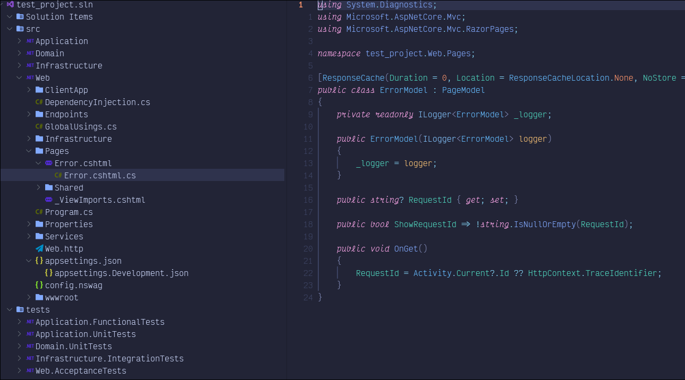

<div align="center">
  <h1>🌩️ Explorer.Dotnet.nvim</h1>
  <p>
    A Neovim plugin for C# development, providing a solution explorer and project
    management tools.
  </p>

  <p>
    <a href="https://opensource.org/licenses/MIT">
      
    </a>
    <a href="https://github.com/YOUR_USERNAME/Explorer.Dotnet.nvim/actions">
      
    </a>
    <a href="https://github.com/YOUR_USERNAME/Explorer.Dotnet.nvim/stargazers">
      
    </a>
  </p>
</div>

# Neovim C# Development

C# is a powerful language, and Neovim is a powerful editor. This project is
part of a series of plugins that aim to bring the best of C# development to
Neovim, making it a viable alternative to traditional IDEs like Visual Studio
and Rider.

# Work in Progress

This project is a work in progress. It is not yet ready for production use, but
you can try it out and contribute to its development. The goal is to provide a
complete C# development experience in Neovim.

Stay tuned for updates and new features. If you have any suggestions or
feedback, please open an issue or a pull request.

# Existing Features

- [x] Solution file parser for loading nested projects
- [x] Project tree builder
- [x] Partially complete tree renderer

# Screenshot



# Usage

Here's the recommended way to setup this plugin with Lazy.

```lua
return {
  "xentropic-dev/explorer.dotnet.nvim",
  config = function()
    require("dotnet_explorer").setup({
      renderer = {
        width = 40,
        side = "right",
      },
    })
  end,
  keys = {
    { "<leader>ee", "<cmd>ToggleSolutionExplorer<cr>", desc = "Toggle Solution Explorer" },
  },
}

```

# Roadmap

The goal is to eventually have as much of the functionality of Visual Studio
and Rider as possible, but with a Neovim emphasis on keyboard navigation and
shortcuts.

## Missing Features

### Tree View

Tree view components:

- [x] file tree
- [x] file icons
- [x] code behind grouping
  - [x] razor, razor.cs, razor.css, razor.js etc.
  - [x] appsettings.json, appsettings.Development.json, etc.
- [x] expand/collapse folders
- [x] controls to open/close files
- [ ] Special c# icons
  - [ ] Properties
  - [ ] wwwroot
- [ ] github integration (file/icon highlighting)
- [ ] dependencies section
  - [ ] ⚙ imports
  - [ ] ⛭ .NET dependencies

### File Management

- [ ] file management
  - [ ] create file
    - [ ] class
    - [ ] interface
    - [ ] razor component
  - [ ] delete file
  - [ ] rename file
    - [ ] investigate smart rename with LSP
    - [ ] ability to rename file and class
  - [ ] move file
    - [ ] ability to automatically update namespaces with LSP
  - [ ] copy file
  - [ ] upload file
- [ ] helpers
  - [ ] intelligent default namespace on cs files
  - [ ] templates for file creation (class, interface, razor component, etc.)
- [ ] file search

### Solution/Project Management

- [ ] projects
  - [ ] create project
  - [ ] delete project
  - [ ] rename project
  - [ ] move project
  - [ ] copy project
- [ ] templates and scaffolding
  - [ ] picker ui for selection project templates
  - [ ] configuration wizards for creating projects from templates
  - [ ] create solution from template
  - [ ] create project from template
  - [ ] create file from template
